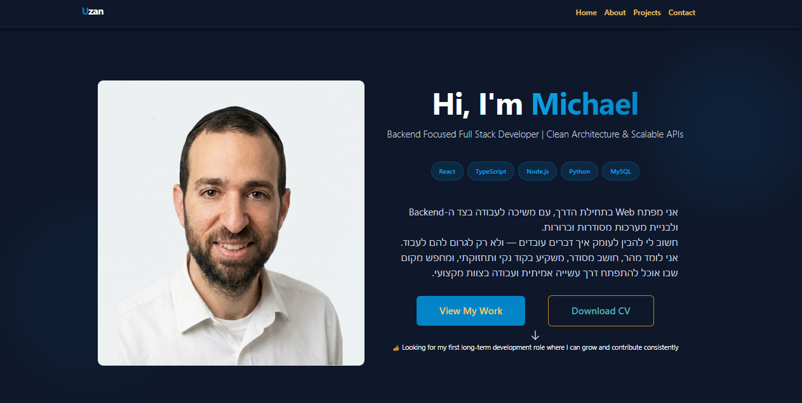

# Michael Uzan Portfolio

Personal portfolio website built to present my software engineering work, featured projects, and technical background in a clear, production-style format.

🚀 Live site: https://MichaelAlonU.github.io/Portfolio

## Purpose

This repo supports the live portfolio site. It is meant to show:

- Frontend implementation quality
- Clear presentation of real project work
- Responsive UI built with modern React tooling

## Tech Stack

- React
- Vite
- Bootstrap
- React Router

## Featured Work

The portfolio highlights selected projects, including the Vacation Management System, with links to demos and source repositories where relevant.

## Repo Guide

- `src/pages` contains the main portfolio sections
- `src/components` contains layout and reusable UI components
- `src/data/portfolio.js` contains the portfolio content and project data
- `src/index.css` contains the global styling

## Notes

This repository is intentionally lightweight. If you want deeper implementation details, the linked project repositories are the better place to review architecture, business logic, and full-stack code.

## Application view

## Author

Michael Alon Uzan